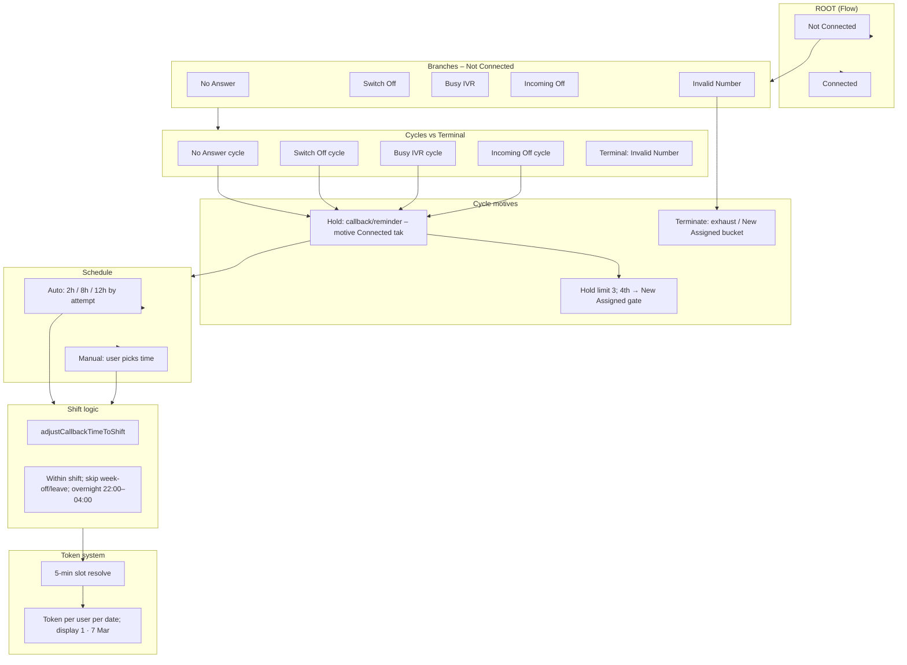
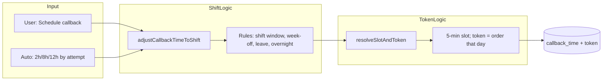

# System structure: Root → Branches → Cycles → Motives → Schedule → Token → Shift

Ek hi document mein puri structure: **roots**, **branches**, **cycles**, **cycle motives** (hold vs terminate), **manual / auto schedule**, **token system**, **shift logic**.

---

## 1. Master diagram (ek nazar mein)

```
ROOT (Flow)
│
├── Not Connected
│   │
│   ├── BRANCHES (tags): No Answer | Switch Off | Busy IVR | Incoming Off | Invalid Number
│   │
│   ├── CYCLES (4): No Answer, Switch Off, Busy IVR, Incoming Off
│   │   │
│   │   ├── CYCLE MOTIVE: HOLD
│   │   │   • Callback / reminder / follow-up → lead ko Connected branch tak lana
│   │   │   • Hold limit (e.g. No Answer): 3 holds; 4th → New Assigned gate (terminate nahi, admin bucket)
│   │   │
│   │   └── CYCLE MOTIVE: TERMINATE
│   │       • Invalid Number → confirm → exhaust (terminal)
│   │       • WhatsApp Not Available (Incoming Off) → exhaust
│   │
│   ├── SCHEDULE (callback kab lagega)
│   │   ├── AUTO SCHEDULE (No Answer, Switch Off, Busy IVR)
│   │   │   • Attempt 1 → 2h, Attempt 2 → 8h, Attempt 3 → 12h (from now)
│   │   │   • Sab SHIFT LOGIC se adjust (within shift, skip week-off/leave; overnight 22:00–04:00 supported)
│   │   │   • Phir TOKEN: 5-min slot + token per user per date
│   │   │
│   │   └── MANUAL SCHEDULE (user chooses time: 15 min, 1 hr, Tomorrow 10 AM, etc.)
│   │       • Same: SHIFT LOGIC → then TOKEN (5-min slot, token)
│   │
│   └── TOKEN SYSTEM
│       • Per (assigned_to, date): 5-min slot resolve → token = 1, 2, 3… (order that day)
│       • Display: "1 · 7 Mar" (token + date)
│
└── Connected
    │
    ├── BRANCHES (tags): Not Interested | Interested
    │   (Special: WhatsApp Flow Active – Incoming Off se aata hai)
    │
    ├── Not Interested → Review (junction); exhaust / back (terminal nahi)
    └── Interested → cycle; sub-flow Document received; move_green etc.
```

---

## 2. Mermaid: Root → Branches → Cycles → Motives → Schedule → Token & Shift



---

## 3. Data flow: Schedule → Shift → Token



---

## 4. Quick reference table

| Layer | What |
|-------|------|
| **Root** | Connected, Not Connected (flow) |
| **Branches** | Tags: No Answer, Switch Off, Busy IVR, Incoming Off, Invalid Number (Not Connected); Not Interested, Interested (Connected) |
| **Cycles** | No Answer, Switch Off, Busy IVR, Incoming Off (hold/callback); Invalid Number = terminal |
| **Cycle motive – Hold** | Callback/reminder/follow-up; motive = lead ko Connected tak; limit 3 (No Answer), 4th → New Assigned gate |
| **Cycle motive – Terminate** | Exhaust (Invalid Number, WhatsApp Not Available); New Assigned = admin bucket (terminate nahi) |
| **Manual schedule** | User chooses time (15 min, 1 hr, Tomorrow 10 AM, etc.) → shift logic → token |
| **Auto schedule** | No Answer/Switch Off/Busy IVR: attempt 1=2h, 2=8h, 3=12h → **pehle shift, phir token, fir hi save** (API guarantee) |
| **Shift logic** | adjustCallbackTimeToShift: within shift, skip week-off/leave, clamp before start; overnight (e.g. 22:00–04:00) = shift end next day |
| **Token system** | Per (user, date): 5-min slot resolve → token 1,2,3…; display "token · date" (e.g. 1 · 7 Mar) |

---

## 5. Implementation verification (pura system mein yahi plan working hai)

Har layer code mein implement hai; koi reh nahi gaya.

| Layer | Code / API | File / usage |
|-------|------------|--------------|
| **Root (Flow)** | `FlowOption` = "Connected" \| "Not Connected" | `types/lead.ts`; CallDialModal, LeadTable, FlowDropdown, API PATCH flow validation |
| **Branches (tags)** | `TAGS_FOR_NOT_CONNECTED`, `TAGS_FOR_CONNECTED`, `NOT_CONNECTED_CYCLE_TAGS`, `NOT_CONNECTED_TERMINAL_TAG` | `types/lead.ts`; CallDialModal, CallbackReminderModal, TagsDropdown, LeadTable |
| **Cycles vs terminal** | 4 cycles + Invalid Number terminal | Same constants; exhaust = `markLeadInvalid`, `is_invalid` in `db.ts` |
| **Hold motive + limit** | `canScheduleMoreHolds(note, tag)`, `MAX_HOLD_ATTEMPTS_NO_ANSWER = 3` | `lib/leadNote.ts`; CallDialModal, CallbackReminderModal – schedule step / "Move to New Assigned" |
| **Terminate / New Assigned** | `markLeadNewAssigned`, `is_new_assigned`; exhaust bucket | `lib/db.ts`; API PATCH `new_assigned`; CallbackReminderModal "Move to New Assigned"; dashboard bucket new_assigned |
| **Auto schedule** | `CALLBACK_AUTO_SCHEDULE_HOURS = [2,8,12]`, `getAutoScheduleHoursForAttempt(attempt)` | `lib/constants.ts`, `lib/leadNote.ts`; CallDialModal, CallbackReminderModal – auto path sends `callbackTime` via PATCH /api/leads |
| **Manual schedule** | User date/time → `callbackTime` → PATCH /api/leads or POST /api/callbacks | CallDialModal `handleSchedule`, CallbackReminderModal manual step; CallbackModal → POST /api/callbacks |
| **Shift logic** | `adjustCallbackTimeToShift`, `isOvernightShift` (22:00–04:00) | `lib/callbackShiftAdjust.ts`; PATCH /api/leads, POST /api/callbacks, fix-callback-times admin API |
| **Token system** | `resolveSlotAndToken`, `computeTokenAssignments`, `formatTokenDisplay` | `lib/tokenSlot.ts`, `lib/tokenBackfill.ts`, `lib/dateUtils.ts`; PATCH /api/leads, POST /api/callbacks, backfill-tokens, fix-callback-times; LeadTable, WorkTable, WaitingListTable |

**Schedule → Shift → Token flow:** Dono **auto** aur **manual** schedule `callbackTime` API ko bhejte hain. PATCH `/api/leads` (aur POST `/api/callbacks`) pehle `adjustCallbackTimeToShift` chalata hai, phir `resolveSlotAndToken`; isliye **shift logic + token** dono har schedule path pe lag rahe hain. Kahi reht nahi.

---

## 6. Related docs

| Doc | Content |
|-----|---------|
| [GLOSSARY-FLOW-TAG-ACTIONS.md](GLOSSARY-FLOW-TAG-ACTIONS.md) | Flow, tag, sub-flow, action, terminal, hold limit |
| [complete-flow-tree.md](complete-flow-tree.md) | Roots, branches, cycles, actions, modals |
| [hold-and-new-assigned-tree.md](hold-and-new-assigned-tree.md) | Hold motive, hold limit, New Assigned gate |
| [auto-schedule-rules-tree.md](auto-schedule-rules-tree.md) | 2h / 8h / 12h auto-schedule |
| [token-system-full-diagram.md](token-system-full-diagram.md) | Token + 5-min slot + shift step-by-step |
| webapp/src/lib/callbackShiftAdjust.ts | 22:00–04:00 overnight shift: shift end = next day 04:00 |
