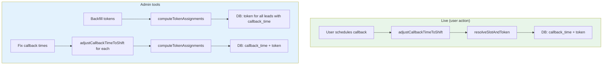
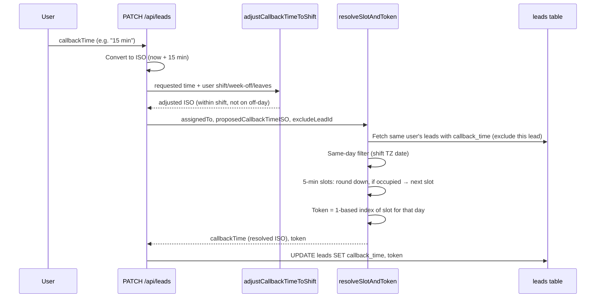
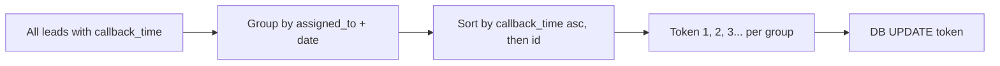
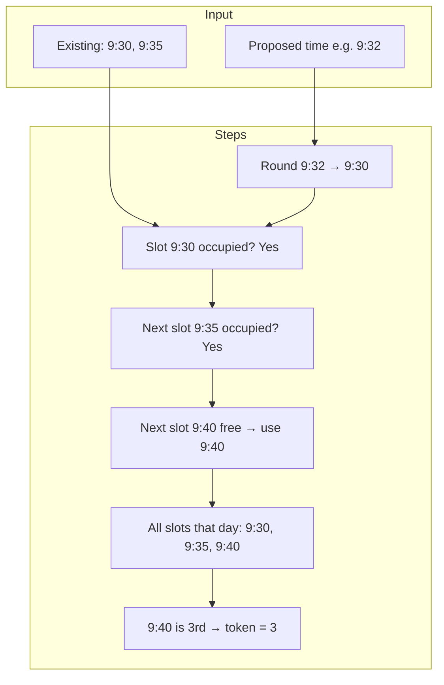
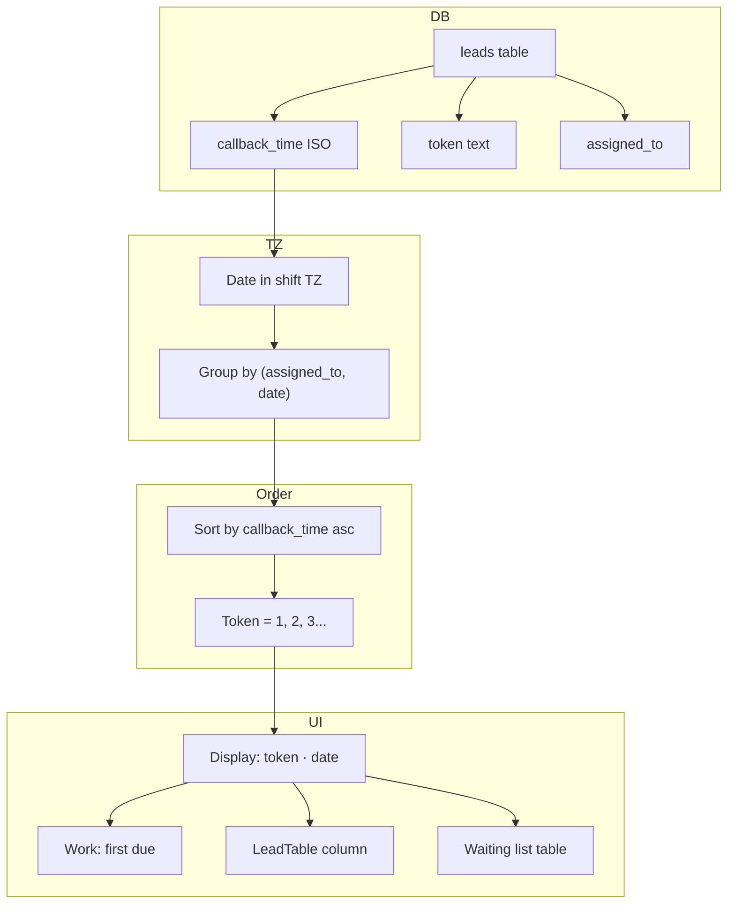

# Token System – Full Detail Diagram

**Mobile number = lead ki primary key.** Token = **callback/reminder order** sirf usi lead ke liye jo callback time pe hai. Token **per user, per date** unique hota hai (shift timezone ke hisaab se date).

---

## 1. Token Kya Hai?

| Term | Meaning |
|------|--------|
| **Token** | Ek number (1, 2, 3…) jo batata hai: is **user** ke **us din** (callback date) ke hisaab se is lead ki **callback order** kya hai. |
| **Scope** | **Per (assigned_to, date)**. Same user ko 7 Mar pe token 1, 8 Mar pe bhi token 1 ho sakta hai – dono alag din hain. |
| **Display** | UI mein hamesha **token + date** dikhta hai, jaise `1 · 7 Mar`, taaki alag din wale same number confuse na hon. |

```
User A, 7 Mar  →  Lead X (9:30) → token 1
                   Lead Y (9:35) → token 2
                   Lead Z (9:40) → token 3

User A, 8 Mar  →  Lead P (9:30) → token 1   ← same number, different day = OK
                   Lead Q (9:35) → token 2

User B, 7 Mar  →  Lead M (10:00) → token 1   ← different user, same date = separate count
```

---

## 2. High-Level Flow (Kab Token Set Hota Hai)



- **Live:** Jab koi lead pe callback schedule hota hai (CallDial / LeadDetail / Reminder modal) → pehle time shift/leave ke hisaab se adjust → phir 5‑minute slot + token assign → DB update.
- **Backfill:** Admin “Backfill tokens” chalata hai → saari leads jinke paas `callback_time` hai unhe (user + date) ke hisaab group karke time order mein 1, 2, 3… assign.
- **Fix callback times:** Admin “Fix callback times” chalata hai → purani wrong times shift start ke hisaab fix → phir wahi backfill logic se token dubara set.

---

## 3. Live Path: Schedule Callback → Token (Step-by-Step)



### 3.1 adjustCallbackTimeToShift (Shift Logic)

- **Input:** Requested callback time (ISO), user ka shift start/end, week-off days, leave dates, timezone (e.g. +330 min).
- **Rules:**
  - Agar requested time **shift ke andar** hai aur **working day** pe hai → wahi time (ya clamp to shift start agar time shift se pehle hai).
  - Agar **week-off ya leave** pe hai → next working day at **shift start**.
  - Agar **shift end ke baad** hai → next day shift start.
- **Output:** Ek ISO jo shift + week-off/leave rules satisfy karta hai.

### 3.2 resolveSlotAndToken (5-Min Slots + Token)

- **Input:** `assignedTo`, `proposedCallbackTimeISO`, `excludeLeadId`, Supabase client.
- **Steps:**
  1. Proposed time ko **shift TZ** mein **date** nikalo (YYYY-MM-DD).
  2. Is user ki saari leads (is lead ko chhod ke) jinka `callback_time` same date pe hai, fetch karo.
  3. **5-minute slots:** Minutes ko 0, 5, 10, …, 55 pe round down. Agar ye slot already kisi aur lead pe hai to **next 5-min slot** use karo (same day, shift ke andar).
  4. **Token:** Us din is user ke saare callback times (existing + ye naya) ko slot key se sort karo; is lead ka slot kahan aata hai — **position = token** (1-based).  
     Example: 9:30 → 1, 9:35 → 2, 9:40 → 3.
- **Output:** `callbackTime` (resolved ISO), `token` (string "1", "2", …).

---

## 4. Backfill Path: Saari Leads Pe Token (Admin)



- **Group key:** `(assigned_to, date)` — date = `callback_time` ka date **shift TZ** mein.
- **Order:** Har group ke andar `callback_time` ascending, tie-break `id`.
- **Token:** Har group mein pehli lead → 1, doosri → 2, … (same logic as “time order”).
- **File:** `lib/tokenBackfill.ts` → `computeTokenAssignments()`; API: `POST /api/admin/backfill-tokens`.

---

## 5. 5-Minute Slot Detail (resolveSlotAndToken)



- Slot key format: `YYYY-MM-DDTHH:mm` (minutes 0, 5, 10, …, 55).
- Token = us din is user ke **sorted slot list** mein is lead ka **1-based index**.

---

## 6. UI Mein Token Kahan Dikhta Hai

| Place | What is shown |
|-------|----------------|
| **LeadTable (My Leads)** | Column “Token”: `formatTokenDisplay(lead)` → e.g. `1 · 7 Mar`, `2 · 7 Mar`, `1 · 8 Mar`. |
| **Work page** | Jo lead **token order** (callback_time sabse pehle) pe hai, usi pe focus; token + date same format. |
| **Waiting list** | Calendar pe date pe count; date select karne pe table mein leads with token + date. |
| **CallDial / Lead detail** | Callback time + reminder; token column wahi DB value use karta hai. |

**formatTokenDisplay(lead):**
- Agar `lead.token` empty → `""`.
- Agar `lead.callbackTime` hai → `token + " · " + short date` (e.g. `1 · 7 Mar`).
- Warna sirf `token`.

---

## 7. Data Flow Summary



---

## 8. Important Files

| File | Role |
|------|------|
| `lib/tokenSlot.ts` | Live scheduling: 5-min slot resolve + token for one lead (`resolveSlotAndToken`). |
| `lib/tokenBackfill.ts` | Batch: group by (user, date), sort by time, assign token (`computeTokenAssignments`). |
| `lib/dateUtils.ts` | `formatTokenDisplay(lead)`, `formatTokenDateShort`, `getDateKey`. |
| `lib/callbackShiftAdjust.ts` | Shift/week-off/leave + clamp to shift start; used before slot resolve. |
| `app/api/leads/route.ts` | PATCH: callback time set → adjust → resolveSlotAndToken → update. |
| `app/api/admin/backfill-tokens/route.ts` | Admin: computeTokenAssignments → bulk update token. |
| `app/api/admin/fix-callback-times/route.ts` | Fix times then recompute tokens. |

---

## 9. Token Lifecycle (Ek Nazar Mein)

```
[User schedules callback]
         │
         ▼
┌─────────────────────────────┐
│ adjustCallbackTimeToShift    │  ← Shift, week-off, leave, clamp to shift start
└─────────────────────────────┘
         │
         ▼
┌─────────────────────────────┐
│ resolveSlotAndToken         │  ← 5-min slot (free slot), token = order that day
└─────────────────────────────┘
         │
         ▼
   DB: callback_time + token
         │
         ├──► Work page: first due lead (by callback_time = token order)
         ├──► LeadTable: column Token → formatTokenDisplay → 1 · 7 Mar
         └──► Waiting list: by date → table with token · date

[Admin: Backfill / Fix callback times]
         │
         ▼
┌─────────────────────────────┐
│ computeTokenAssignments     │  ← Group (user, date), sort by time, token = 1,2,3…
└─────────────────────────────┘
         │
         ▼
   DB: token updated for all leads with callback_time
```

---

## 10. One-Line Summary

**Token = us user ke us din (callback date) ke hisaab se callback/reminder ki 1-based order; 5-minute slot se conflict nahi hota; UI mein hamesha “token · date” (e.g. 1 · 7 Mar) dikhaya jata hai.**
