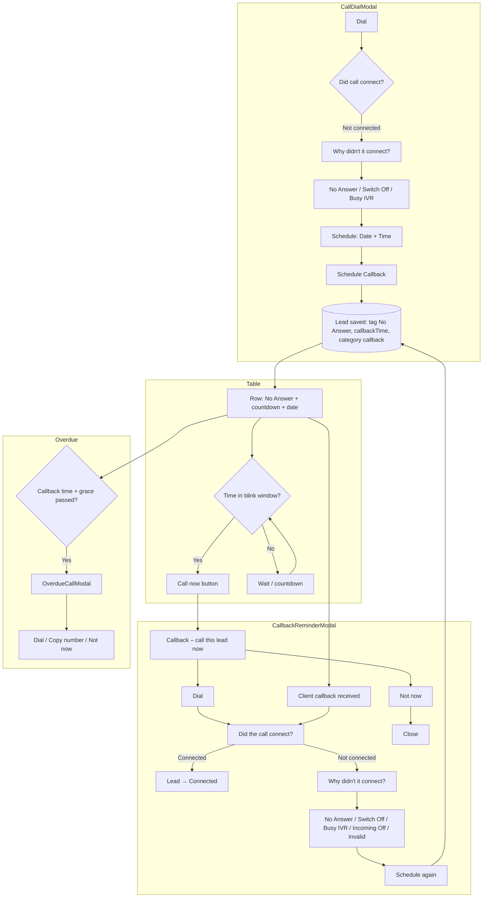
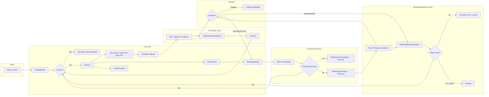
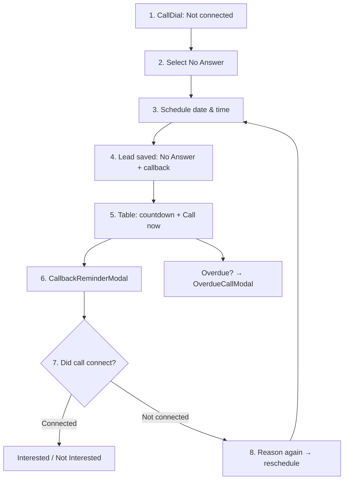
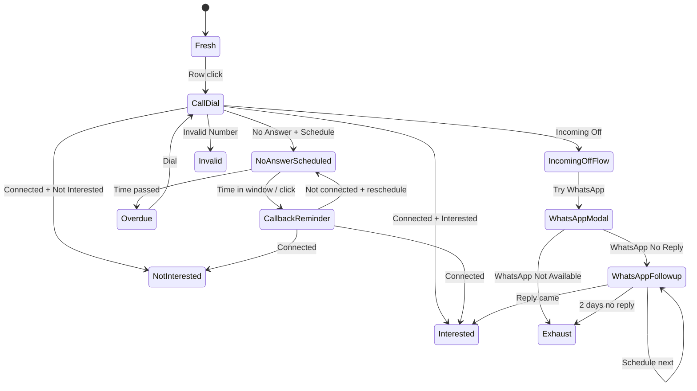

# Lead Management – Flow Diagrams

## Cycles by tag name (summary)

| # | Tag name | Cycle? | Cycle name | Notes |
|---|----------|--------|------------|--------|
| 1 | **No Answer** | Yes | Callback cycle | Schedule → countdown → CallbackReminder → connect / reschedule / overdue |
| 2 | **Switch Off** | Yes | Same as No Answer | Callback cycle (same flow) |
| 3 | **Busy IVR** | Yes | Same as No Answer | Callback cycle (same flow) |
| 4 | **Incoming Off** | Yes | Incoming Off cycle | Try WhatsApp → Not Available (exhaust) / No Reply (follow-up cycle) |
| 5 | **Invalid Number** | No | — | Single outcome (InvalidNumberModal / mark active), no callback |
| 6 | **WhatsApp Flow Active** | Yes | WhatsApp follow-up cycle | Did reply come? → schedule again / 2 days → exhaust / connected |
| 7 | **Interested** | Yes | Interested cycle | New / Document received → document follow-up, etc. |
| 8 | **Document received** | Yes | Part of Interested | Document follow-up (callback/follow-up) |
| 9 | **Not Interested** | No | — | Reason + form → review (terminal) |

**Total distinct cycles by tag:**  
- **Callback cycle:** 3 tags (No Answer, Switch Off, Busy IVR) → **1 cycle**  
- **Incoming Off cycle:** 1 tag → **1 cycle**  
- **WhatsApp follow-up cycle:** 1 tag (WhatsApp Flow Active) → **1 cycle**  
- **Interested / Document cycle:** 2 tags → **1 cycle**  
- **No cycle (terminal):** Invalid Number, Not Interested → **0 cycles**

So by tag name: **4 unique cycles**; **9 tags** (7 with a cycle path, 2 terminal).

---

## 1. No Answer cycle (detailed)

---

## 2. All main cycles (overview)

---

## 3. No Answer – linear steps (simple)

---

## 4. State view – where a lead can be

---

*Generated for TeamDX-Sheet Lead Management. View in any Mermaid-compatible viewer (e.g. GitHub, VS Code with Mermaid extension).*
