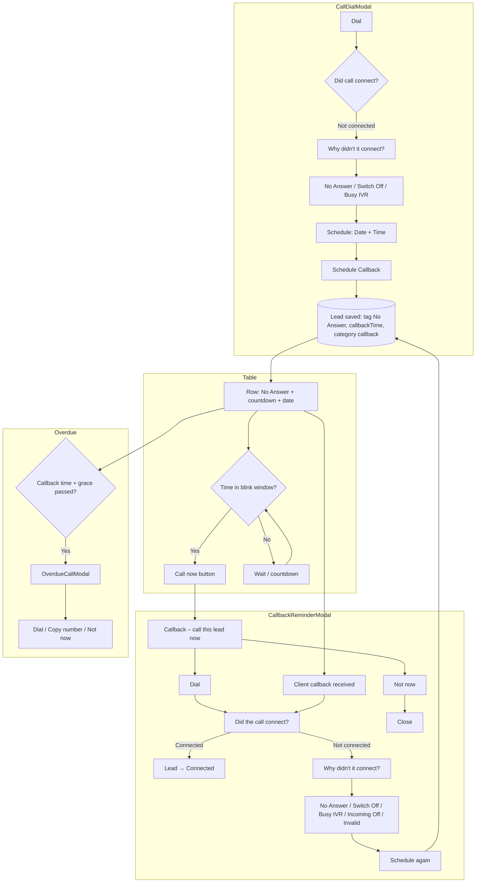
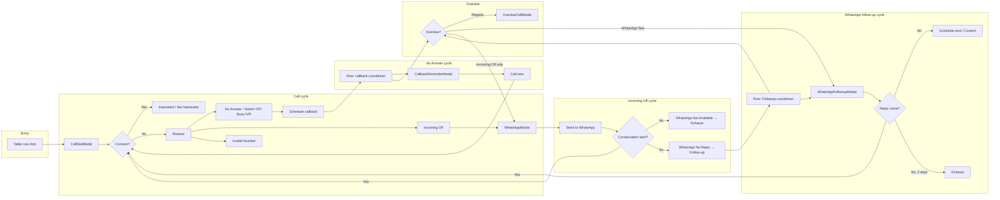
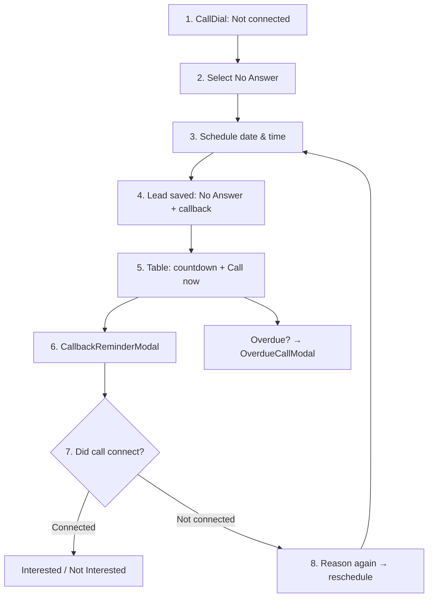
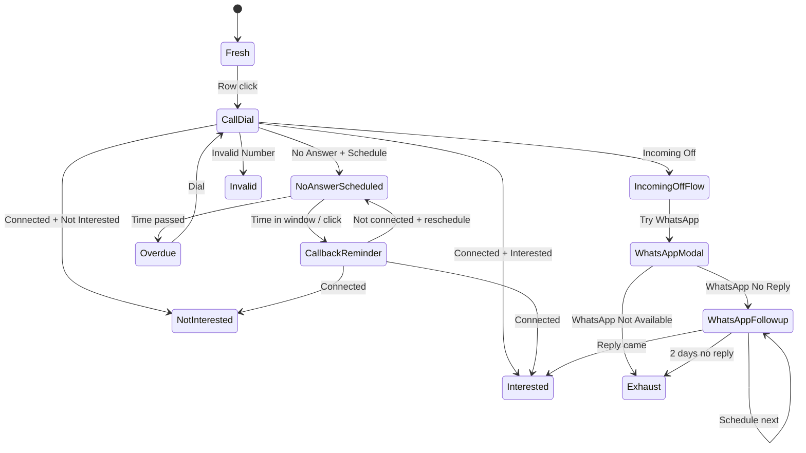

# Lead Management – Flow Diagrams

## Not Connected: 4 cycles + 1 terminal (global rule)

**Not Connected** = **5 tags**: No Answer | Switch Off | Busy IVR | Incoming Off | Invalid Number.

- **4 cycles:** No Answer cycle, Switch Off cycle, Busy IVR cycle, Incoming Off cycle.  
  (Cycle = us tag se start se end tak ka complete flow.)
- **1 terminal:** **Invalid Number**. Reason = invalid number; no cycle, no callback.

**Source of truth:** `NOT_CONNECTED_CYCLE_TAGS`, `NOT_CONNECTED_TERMINAL_TAG` in `types/lead.ts`. Is rule ko globally use karo — confusion avoid.

---

## Terminal (global rule – active)

**Terminal = sirf exhaust.** Review terminal nahi.

- **Terminal** = cycle khatam + terminal gate open + lead **exhaust**. Aage koi cycle/callback nahi.
- **Review** = terminal nahi. Review = junction/hide; lead senior ke paas; senior back/forward ya exhaust (terminal) decide karta hai.

| Where | Terminal (sirf exhaust) | Result |
|-------|-------------------------|--------|
| Not Connected | Invalid Number | Lead → exhaust. Reason: invalid number. |
| Incoming Off cycle | WhatsApp Not Available → Apply | Cycle khatam, lead → exhaust (terminal gate open). |

Not Interested → review (senior review); final terminal = exhaust only. See GLOSSARY §8.

---

## Hold limit and New Assigned gate

- **Hold** = callback/reminder/follow-up; motive = lead ko Connected tak lana. Hold ki limit hai (e.g. No Answer: max 3 attempts).
- **4th hold** apply nahi hota → **New Assigned gate** open → lead **New Assigned** bucket (admin only; not terminal/exhaust).  
- See `docs/hold-and-new-assigned-tree.md` and GLOSSARY §3.2.

---

## Auto-schedule rule (No Answer, Switch Off, Busy IVR)

- **Attempt 1** = 2 hours, **Attempt 2** = 8 hours, **Attempt 3** = 12 hours from now (all adjusted by shift logic on save).
- Same rule for No Answer, Switch Off, Busy IVR cycles. See `docs/auto-schedule-rules-tree.md` and GLOSSARY §3.3.

---

## Cycles by tag name (summary)

| # | Tag name | Cycle? | Cycle name | Notes |
|---|----------|--------|------------|--------|
| 1 | **No Answer** | Yes | No Answer cycle | Schedule → countdown → CallbackReminder → connect / reschedule / overdue |
| 2 | **Switch Off** | Yes | Switch Off cycle | Same flow as No Answer cycle |
| 3 | **Busy IVR** | Yes | Busy IVR cycle | Same flow as No Answer cycle |
| 4 | **Incoming Off** | Yes | Incoming Off cycle | Try WhatsApp → Not Available (exhaust) / No Reply (follow-up) |
| 5 | **Invalid Number** | No (terminal) | — | Reason: invalid number. No cycle, no callback. |
| 6 | **WhatsApp Flow Active** | Yes | WhatsApp Flow Active cycle | Did reply come? → schedule again / 2 days → exhaust / connected |
| 7 | **Interested** | Yes | Interested cycle | New / Document received → document follow-up, etc. |
| 8 | **Document received** | Yes | Part of Interested | Document follow-up (callback/follow-up) |
| 9 | **Not Interested** | No (→ review) | — | Reason + form → review (senior); review terminal nahi, senior back/forward ya exhaust |

**Not Connected:** 4 cycles + 1 terminal (Invalid Number → exhaust). Terminal = sirf exhaust.  
**Connected:** 1 cycle (Interested). Not Interested → review (senior); review terminal nahi.  
**Special:** WhatsApp Flow Active cycle.

---

## 1. No Answer cycle (detailed)

---

## 2. All main cycles (overview)

---

## 3. No Answer – linear steps (simple)

---

## 4. State view – where a lead can be

---

*Generated for TeamDX-Sheet Lead Management. View in any Mermaid-compatible viewer (e.g. GitHub, VS Code with Mermaid extension).*
